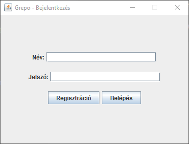
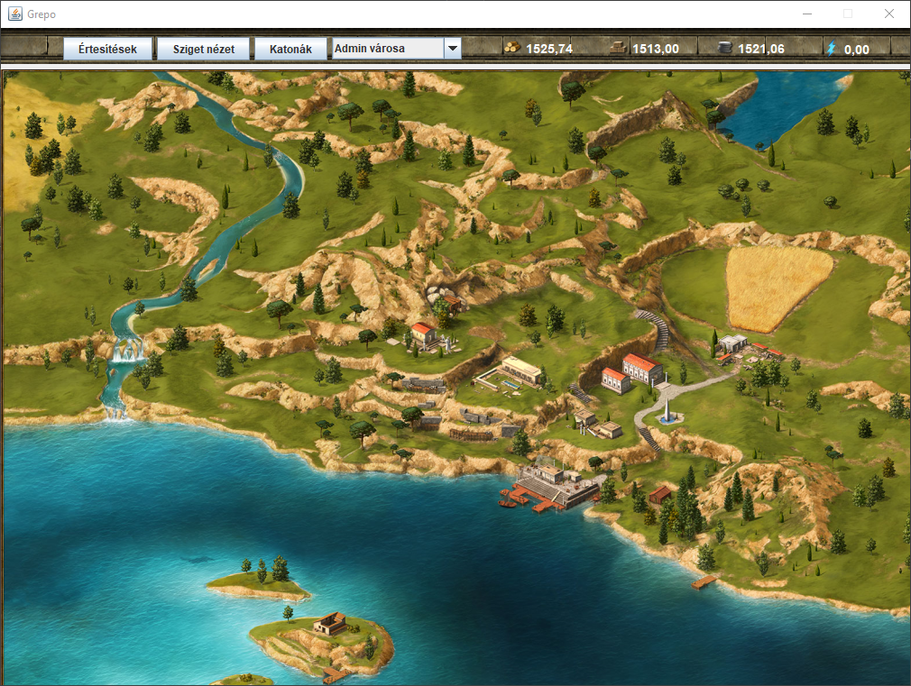
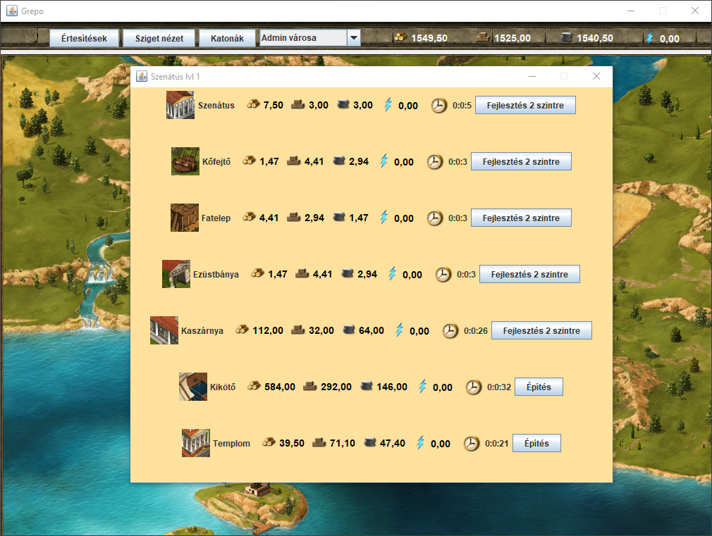
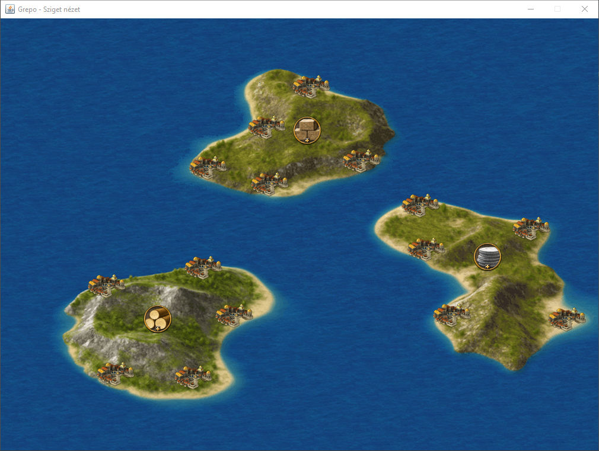
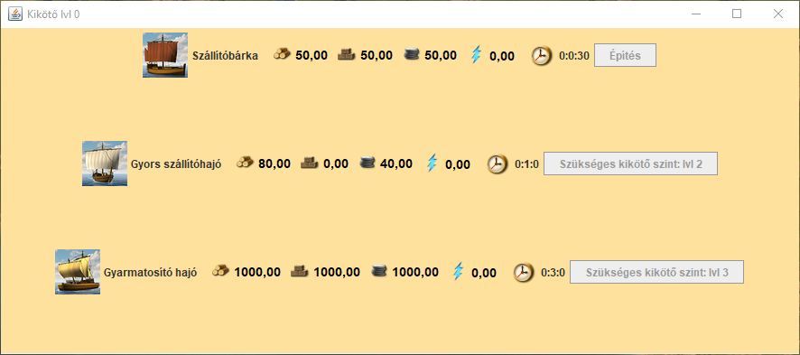
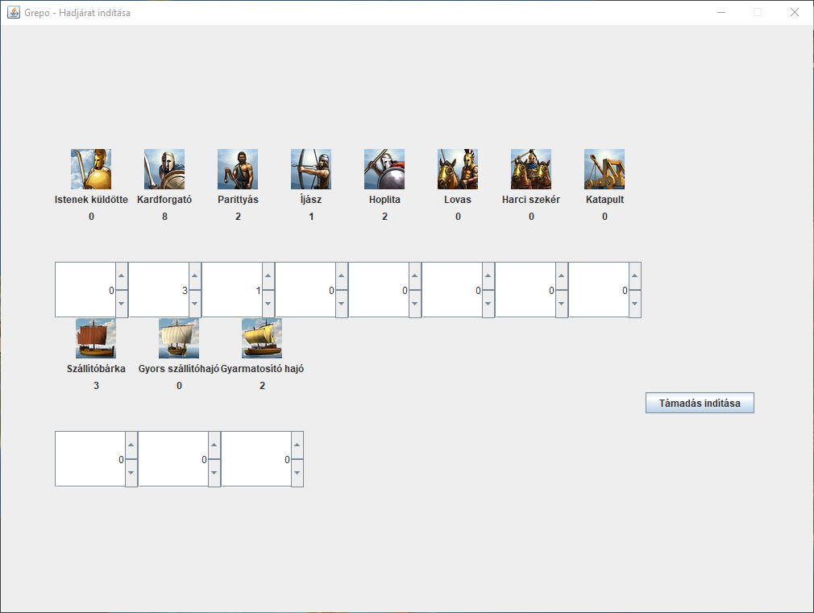

# Grepo - Programming 3 homework 2020

## This is Grepolis-like game made in Java using Swing.

### Features
- Account creation
- You can gather resources to support your army
- You can build and upgrade buildings like Temple, Barracks, Senate, Harbor etc.
- You can train ground units like swordsmen and archers
- You can build ships in the harbor
- You can attack other players with your naval and ground units
- You can conquer cities when you defeat the defenders of them

## Some picture from the game

*I used images from the official Grepolis game.*
